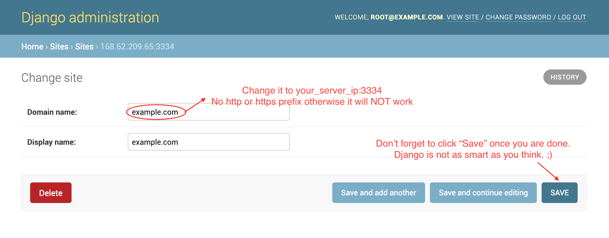

# TheSpaghettiDetective

This repo is everything you need to run a server for [The Spaghetti Detective](https://thespaghettidetective.com), the coolest, AI-based solution for 3D printer remote management and monitoring.

The core of this project is based on a Deep Learning model. [See how the model works on real data](https://app.thespaghettidetective.com/ent_pub/publictimelapses/).

# Install and run the server
*Warning: Any guide not directly maintained by the TSD Team and Contributers may be outdated, and should be used at user discretion. Always cross-check commands and instructions used with those located on this repo.*

If you are on Windows 10 and prefer a video tutorial, head to LukesLaboratory's [awesome video](https://www.youtube.com/watch?v=8l4C_K9S2-Y) (Big shout-out to [@LukesLaboratory](https://twitter.com/LukesLaboratory/)).

If you are on Windows Server, follow [this Windows Server-specific guide](docs/server_2019.md) instead.

If you are on a NVIDIA Jetson Nano, follow [this Jetson Nano specific guide](docs/jetson_guide.md) instead.

If you are on UNRAID, follow [this UNRAID specific guide](docs/unraid_guide.md) instead.

If you otherwise prefer textual instructions, follow the steps below.

## Prerequisites

### Hardware minimum spec

The Spaghetti Detective server needs to run on a real computer (Not a Pi, unfortunately. Raspberry Pi (yes even the Pi 4b,) or Latte Panda, is just not powerful enough to run the Machine Learning model). If you have an old PC with at least 4GB of memory, you will be probably be fine.

### Software requirements

The following software is required before you start installing the server:

- Docker and Docker-compose. But you don't have to understand how Docker or Docker-compose works.
    - Install Docker ([Windows](https://docs.docker.com/docker-for-windows/install/), [Ubuntu](https://docs.docker.com/install/linux/docker-ce/ubuntu/), [Fedora](https://docs.docker.com/engine/install/fedora/), [CentOS](https://docs.docker.com/engine/install/centos/), [Mac](https://docs.docker.com/docker-for-mac/install/)). **Important:** If your server has an old Docker version, please follow the instructions in these links to upgrade to the latest version, otherwise you may run into all kinds of weird problems.
    - [Install Docker-compose](https://docs.docker.com/compose/install/). You need Docker-compose V2.0 or higher.
- git ([how to install](https://git-scm.com/downloads)).

### Email delivery

You will also need an email account that has SMTP access enabled. For a gmail account, this is [how you enable SMTP access](https://support.google.com/accounts/answer/6010255?hl=en). Other web mail such as Yahoo
should also work but we haven't tried them.

## Get the code and start the server.

1. Get the code:

```
git clone -b release https://github.com/TheSpaghettiDetective/TheSpaghettiDetective.git
```

2. Run it! Do **either** one of these based on what OS you are using:
    - If you are on Linux: `cd TheSpaghettiDetective && sudo docker-compose up -d`
    - If you are on Mac: `cd TheSpaghettiDetective && docker-compose up -d`
    - If you are on Windows: `cd TheSpaghettiDetective; docker-compose up -d`

3. Go grab a coffee. Step 2 will take 15-30 minutes.

4. There is no step 4. This is how easy it is to get The Spaghetti Detective up and running (thanks to Docker and Docker-compose).


# Basic server configuration

This is the bare minimum configuration required for the server to be functional.

## Obtain server's IP address

The Spaghetti Detective server needs to have an IP address that is accessible by OctoPrint. It can be an private IP address (192.168.x.y, etc) but there needs to be a route between OctoPrint and The Spaghetti Detective server.

## Port/Firewall

The Spaghetti Detective server listens on port 3334. Please make sure this port is not blocked from OctoPrint. See [configuring firewalls on common platforms](docs/firewall_guides.md).

You can set up a reverse-proxy, such as nginx, in front of The Spaghetti Detective server, so that it's exposed on a different port. In this case, please use whichever port you choose to expose in the steps below. For simplicity
sake, this document assumes the server port is 3334.

## Login as Django admin

1. Open Django admin page at `http://your_server_ip:3334/admin/`.

*Note: If the browser complains "Can't connect to the server", wait for a couple more minutes. The web server container may still be starting up.*

2. Login with username `root@example.com`, password `supersecret`. Once logged in, you can optionally (but highly encouraged to) change the admin password using this link: `http://your_server_ip:3334/admin/app/user/1/password/`.

## Configure Django site

1. In the same browser window, go to the address `http://your_server_ip:3334/admin/sites/site/1/change/`. Change "Domain name" to `your_server_ip:3334`. No "http://", "https://" prefix or trailing "/", otherwise it will NOT work. *Note: Deleting the original site and adding a new one won't work, thanks to the quirkiness of Django site.*

2. Click "Save". Yes it's correct that Django is not as smart as most people think. ;)



*Note: If you are using reverse proxy, "Domain name" needs to be set to `reverse_proxy_ip:reverse_proxy_port`. See [using a reverse proxy](docs/advanced_config.md#using-a-reverse-proxy) for details.*

## Configure Email server (SMTP)

The following is using gmail as an example. Other web mail services may vary slightly, such as EMAIL_PORT

1. In `TheSpaghettiDetective` directory, find and open `docker-compose.yml` using your favorite editor.

2. Find the following lines, and set them to the correct values of your email account:

```
      EMAIL_HOST:     # -> such as smtp.gmail.com
      EMAIL_HOST_USER:   # -> such as your email address for a Gmail account
      EMAIL_HOST_PASSWORD:    # -> your email account password
      EMAIL_PORT: 587
      EMAIL_USE_TLS: 'True'
```

If you run into issues with Email server settings, please follow this [Email server trouble-shooting guide](docs/email_guide.md).

# Done!

That's it! You now have a fully-functional The Spaghetti Detective server that your OctoPrint can talk to. We hope setting up the server has not been overwhelming.

# Configure The Spaghetti Detective OctoPrint Plugin to use your own server

Before you can configure The Spaghetti Detective OctoPrint Plugin to use your own server, you need add a printer to The Spaghetti Detective server you just built and obtain the 6-digit Verification Code for that. To do so:

1. Pointing your browser to `http://your_server_ip:3334`.

1. Log in as a user (you can just login with `root@example.com` but it's more secure to use a non-admin user).

1. Add a new printer as described in [this guide](https://www.thespaghettidetective.com/docs/octoprint-plugin-setup-manual-link/) and obtain the 6-digit Verification Code. *Note: Do it on your own server, not on [The Spaghetti Detective cloud](https://app.thespaghettidetective.com).*

Then, navigate to octoprint to setup the plugin side of things:

1. Make sure that you have installed the [TSD plugin](https://www.thespaghettidetective.com/docs/octoprint-plugin-setup/).

1. After restarting, go through the wizard as described in [the setup guide](https://www.thespaghettidetective.com/docs/octoprint-plugin-setup-manual-link/), until you are at the last step that asks for the 6-digit Verification Code. *Note: If TSD plugin for OctoPrint has been installed before and you do not see the wizard, click [here](https://github.com/TheSpaghettiDetective/TheSpaghettiDetective/master/docs/Rerun-Wizard.md).*

1. Expand "Advanced Server Configuration".  Find and change the Server Address to `http://your_server_ip:3334` (use https:// if you have HTTPS configured, if you aren't sure, just use http://). You MUST include the "http://".

    

1. Enter in your code and octoprint should automatically link to your printer!

1. Give you printer a fancy name and enjoy The Spaghetti Detective!

# Configure The Spaghetti Detective mobile app to use your own server

Download the app for [iOS](https://apps.apple.com/us/app/the-spaghetti-detective/id1540646623?ign-itsct=apps_box&ign-itscg=30200) or [Android](https://play.google.com/store/apps/details?id=com.thespaghettidetective.android)

1. Sign in with an existing TSD cloud account

1. Open the sidebar menu

1. Navigate to "About" -> "Developer Options" -> "Server Settings"

1. Enter your private server URL exactly as it is in the Octoprint plugin, including the port and `http://`

1. Restart the app and login with your private server credentials!

# Access timelapses stored on your server

Although you can simply download the timelapses from either the web interface or the mobile app, it may be important to know exactly where the timelapses are stored on your local machine.

Path to timelapses:

`[TSD Directory]/web/static_build/media/tsd-timelapses/private/`

# Advanced server configuration

Feeling adventurous? [Go advanced](docs/advanced_config.md).

# Operating and maintaining The Spaghetti Detective server

## Upgrade server
```
    cd TheSpaghettiDetective
    git checkout release
    git pull
    docker-compose up --build -d
```
*Note: if you are on linux you will have to run the last line as `sudo`(ex. `sudo docker...`)*
## Backup database

Just make a copy of `TheSpaghettiDetective/web/db.sqlite3`

# How to train your own Machine Learning model (TBD)

# Difficulties at getting The Spaghetti Detective server up and running?

Check out the [FAQ document](docs/faq.md). If you can't find the answer there, consult the [Discord](https://discord.gg/NcZkQfj) or [open an issue](https://github.com/TheSpaghettiDetective/TheSpaghettiDetective/issues/new).

# Thanks
 [BrowserStack](https://www.browserstack.com/) generously sponsors a free license so that I can test TSD webcam streaming on different browsers/versions.
