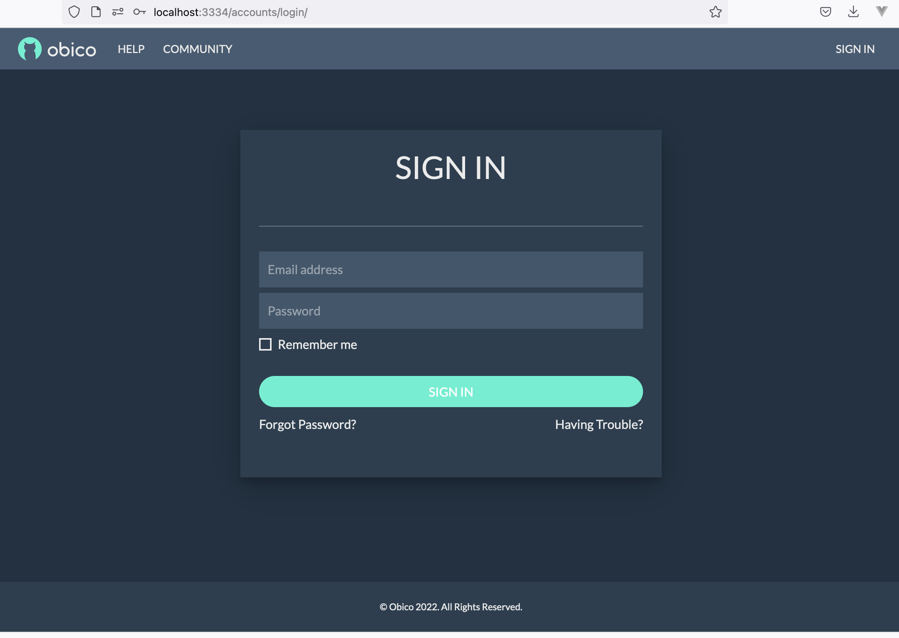
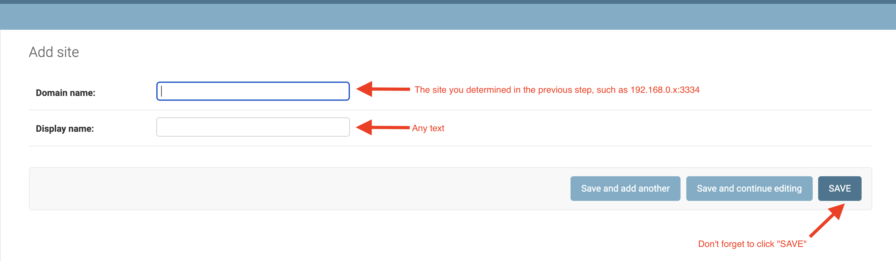

# The Obico Server

This repo is everything you need to run a self-hosted Obico Server.

[Obico](https://www.obico.io) is a community-built, open-source smart 3D printing platform used by makers, enthusiasts, and tinkerers around the world.

The AI failure detection in this project is based on a Deep Learning model. [See how the model works on real data](https://app.obico.io/ent_pub/publictimelapses/).

> **Note:** If you are looking for information about setting up self-hosted server for [JusPrin](https://github.com/TheSpaghettiDetective/JusPrin), please see [README_jusprin_server.md](README_jusprin_server.md) for specific instructions.

# Install and run the server

> **Note:** For more detailed instructions, head to [the Obico Server guide](https://www.obico.io/docs/server-guides/).*

## Prerequisites

The Obico Server only requires a computer to run. Even old PCs (within the previous 10 years) will do just fine. An Nvidia GPU is optional but can vastly increase the power consumption and beef up the number of printers the server can handle.

[Detailed hardware minimum specs](https://www.obico.io/docs/server-guides/hardware-requirements/).

### Software requirements

The following software is required before you start installing the server:

- Docker and Docker-compose. But you don't have to understand how Docker or Docker-compose works.
    - Install Docker ([Windows](https://docs.docker.com/docker-for-windows/install/), [Ubuntu](https://docs.docker.com/install/linux/docker-ce/ubuntu/), [Fedora](https://docs.docker.com/engine/install/fedora/), [CentOS](https://docs.docker.com/engine/install/centos/), [Mac](https://docs.docker.com/docker-for-mac/install/)). **Important:** If your server has an old Docker version, please follow the instructions in these links to upgrade to the latest version, otherwise you may run into all kinds of weird problems.
    - [Install Docker-compose](https://docs.docker.com/compose/install/). You need Docker-compose V2.0 or higher.
- git ([how to install](https://git-scm.com/downloads)).

### Email delivery

You will also need an email account that has SMTP access enabled (gmail will not work. As of May 30, 2022 Google has removed the option for allowing SMTP access). Other web mail such as Yahoo should work but we haven't tried them.

## Get the code and start the server

1. Get the code:

```
git clone -b release https://github.com/TheSpaghettiDetective/obico-server.git
```

2. Run it! Do **either** one of these based on what OS you are using:
    - If you are on Linux: `cd obico-server && sudo docker compose up -d`
    - If you are on Mac: `cd obico-server && docker-compose up -d`
    - If you are on Windows: `cd obico-server; docker-compose up -d`

3. Go grab a coffee. Step 2 will take 15-30 minutes.

4. If the Obico Server is running on `localhost`, there will be no step 4. If it is running on a different host, such as a VM in the cloud, go ahead to [configure the Django site](https://www.obico.io/docs/server-guides/configure/#django-site).

Open "http://localhost:3334" on the same computer. Voila - your self-hosted Obico Server is now up and running!



# Server Configuration

Upon fresh installation, the Obico Server can only work on the localhost. You will need to configure its IP address. Here is how:

## Obtain server's IP address

[Recommended Read: Connecting to your server with a .local address](https://www.obico.io/docs/server-guides/configure/)

This refers to the LAN IP address that has been given to the computer that the Obico server is running on.
- If you are on Linux: Open the wifi settings and select "settings" for the network your device is currently connected to. Look for the IPv4 value.
- If you are on Windows: Select "Properties" for the network your device is connected to, then look for the IPv4 value.
- If you are on Mac: Go to Settings > Network. You will find your IPv4 value below the wifi status.

The Obico Server needs to have an IP address that is accessible by OctoPrint or Klipper. It can be a private IP address (192.168.x.y, etc) but there needs to be a route between OctoPrint and the Obico Server.

It is also recommended that a static IP is set to avoid issues with changing IP's. Please look up your WiFi routers guide on how to do this.

## Login as Django admin

1. Open Django admin page at `http://your_server_ip:3334/admin/`.

> **Note:** If the browser complains "Can't connect to the server", wait for a couple more minutes. The web server container may still be starting up.*

2. Login with username `root@example.com`, password `supersecret`. Once logged in, you can optionally (but are highly encouraged to) change the admin password using this link: `http://your_server_ip:3334/admin/app/user/1/password/`.

## Configure Django site

1. In the same browser window, go to the address `http://your_server_ip:3334/admin/sites/site/1/change/`. Change "Domain name" to `your_server_ip:3334`. No "http://", "https://" prefix or trailing "/", otherwise it will NOT work. *Note: Deleting the original site and adding a new one won't work, thanks to the quirkiness of Django site.*

2. Click "Save". Yes it's correct that Django is not as smart as most people think. ;)



> **Note:** If you are using reverse proxy, "Domain name" needs to be set to `reverse_proxy_ip:reverse_proxy_port`. See [using a reverse proxy](https://www.obico.io/docs/server-guides/advanced/reverse-proxy/) for details.*

That's it! You now have a fully-functional Obico Server that your OctoPrint can talk to. We hope setting up the server has not been overwhelming.

# Configure clients to use self-hosted Obico Server

- [Obico for OctoPrint plugin](https://www.obico.io/docs/server-guides/configure-octoprint-plugin/).
- [Obico mobile app](https://www.obico.io/docs/server-guides/configure-mobile-app).

# Contribute to Obico

Feeling excited? Want to contribute? [Check out how.](https://www.obico.io/docs/developer-guides/contribute/)

# Difficulties in getting the Obico server up and running?

Browse and search in the [Obico Server guide website](https://www.obico.io/docs/server-guides/). If you can't find the answer there, consult the [Discord](https://obico.io/discord) or [open an issue](https://github.com/TheSpaghettiDetective/obico-server/issues/new).

# Thanks
 [BrowserStack](https://www.browserstack.com/) generously sponsors a free license so that I can test Obico webcam streaming on different browsers/versions.
[Moonraker](https://github.com/Arksine/moonraker) for the source code to extract g-code metadata.
