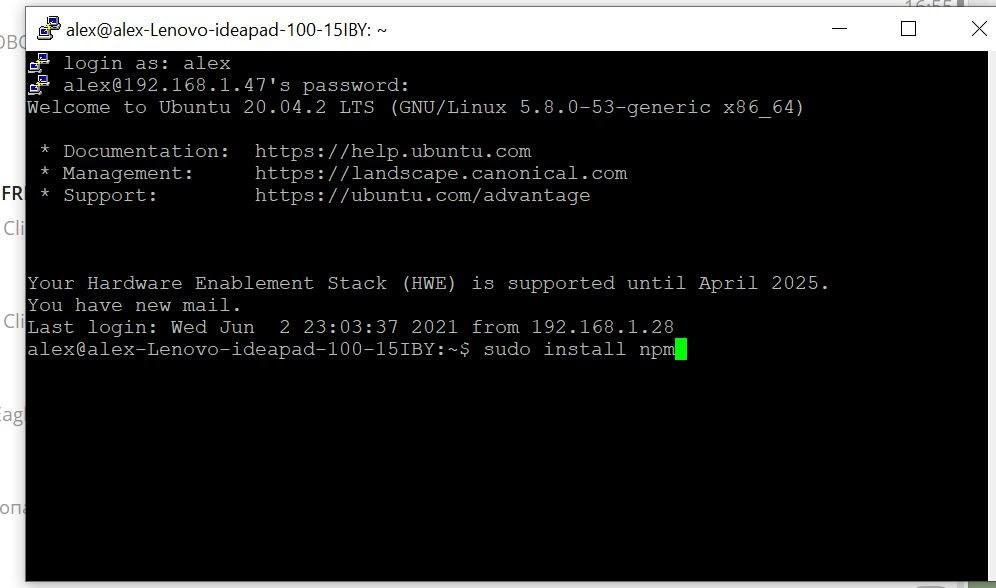
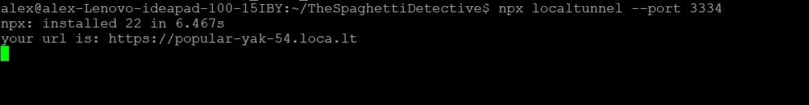
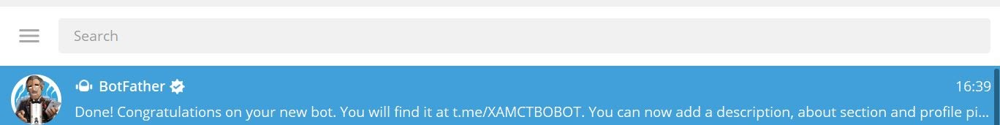
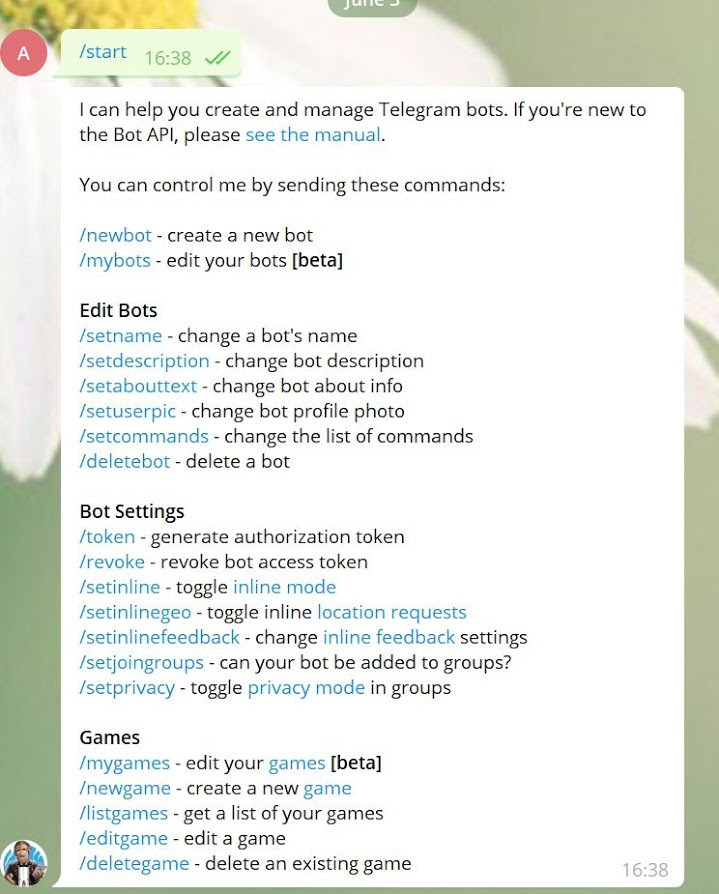
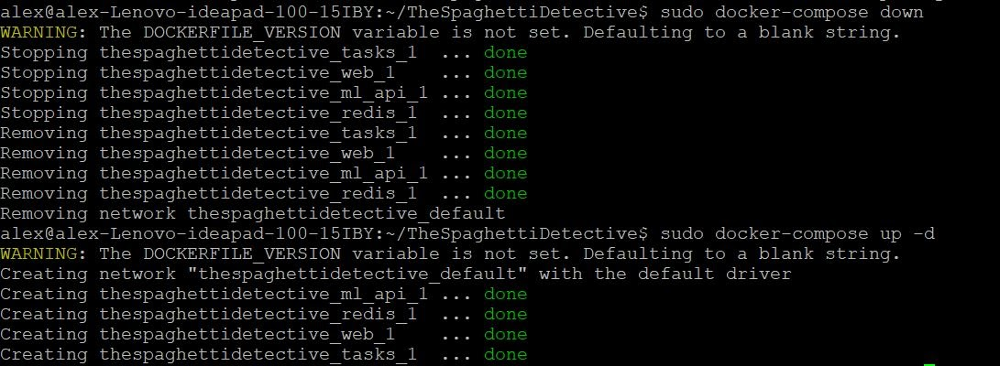
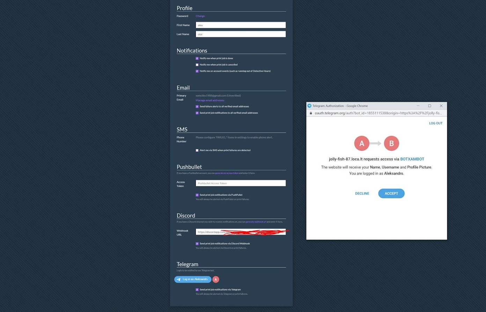

# Telegram Setup Guide

## Link using Telegram Login Widget
My Base: Fresh Install Ubuntu 20.04.

You need to open a terminal with your device. I am doing this via SSH (I'm using Putty on windows).

1. Install nmp
```sh
sudo install npm
```


2. Install looptools
```sh
sudo install looptools
```


3. Install localtunnel and run it
```sh
npx localtunnel --port 3334
```



4. Open telegram (I`m using windows telegram app) and find botfather



5. Start conversation and open a menu
```
/start
```


6. Create your own bot and give him name
```
/newbot
```


7. Get BOT ID and TOKEN


8. Set domain which was given by tunnel in Step 3
```
/setdomain
```


9. Add TOKEN with ID in docker-compose.yml

    - Open the file:
        - Option 1: Edit docker-compose.yml through terminal
        ```shell
        cd TheSpaghettiDetective
        sudo nano docker-compose.yml
        ```
        
        - Option 2: edit it directly
            - Find the folder called `TheSpaghettiDetective` in your home directory
            - Open it. Inside you should find a file called `docker-compose.yml`. Open it.

    - Edit the file to include your ID
    

  
10. Reboot Docker
```sh
cd TheSpaghettiDetective
sudo docker-compose down
sudo docker-compose up -d
```


11. Go on your TSD server VIA link connected to Telegram.

Go in preferences and connect to Telegram.



12. Push Test button after

RESULTS


### Link without Telegram Login Widget

When running in local network you don't need to setup specific domain and go through telegram login widget.
You can register any telegram chat where you want bot sending notification, it can be private or group chat

1. Obtain bot api key form bot father (previous section in step 7).
2. Set bot api key in docker-compose.yml (previous section in step 8).
3. Create chat group or chat with bot directly in the telegram. Write a message that bot can process line "/test".
4. Go to `https://api.telegram.org/bot<chat id>/getUpdates` and find the channel id where you want bot to send messages
5. In Obico go to Preferences->Notifications->Telegram
6. Open developer console in your browser
7. Type and send
```
window.onTelegramAuth({
   id: <chat id>
})
```
7. Telegram is linked, test it with "Test Telegram Notification" button