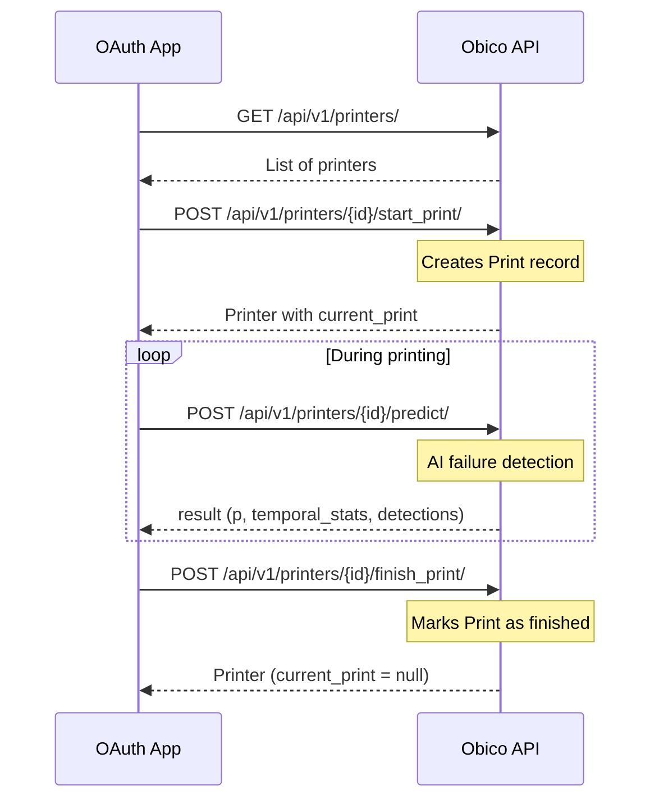

# OAuth App Printer Management API

This guide explains how an OAuth-integrated application can programmatically manage printers, start and end prints, and use AI failure detection in Obico.

## Prerequisites

- An OAuth application registered with Obico
- A valid OAuth access token for a user

## API Flow Overview



## Authentication

All requests require an OAuth Bearer token in the `Authorization` header:

```
Authorization: Bearer YOUR_ACCESS_TOKEN
```

See [OAuth Authentication](/docs/api/api-authentication-oauth) for details on obtaining an access token.

## API Endpoints

### List Printers

```
GET /api/v1/printers/
```

Returns a list of printers owned by the authenticated user.

**Response:**
```json
[
  {
    "id": 123,
    "name": "My Printer",
    "current_print": null,
    "status": {...},
    ...
  }
]
```

---

### Start a Print

```
POST /api/v1/printers/{printer_id}/start_print/
Content-Type: application/json

{
  "filename": "my_model.gcode"
}
```

Starts a new print session for the specified printer.

**Parameters:**
| Field | Type | Required | Description |
|-------|------|----------|-------------|
| `filename` | string | Yes | The name of the file being printed |

**Response:**
```json
{
  "succeeded": true,
  "printer": {
    "id": 123,
    "current_print": {
      "id": 456,
      "filename": "my_model.gcode",
      "started_at": "2026-01-26T15:00:00Z"
    },
    ...
  }
}
```

**Error Cases:**
- `400 Bad Request`: Missing filename or printer is already printing

---

### POST `/api/v1/printers/{printer_id}/predict/` {#predict}

Submits an image for AI failure detection on the current print.

#### Request {#predict-request}

This POST request should be sent as `multipart/form-data` format.

#### Parameters {#predict-parameters}

| Field | Type | Required | Description |
|-------|------|----------|-------------|
| `img` | file | Yes | Snapshot from the webcam for failure detection. In JPEG format. |

#### Response {#predict-response}

##### Status code: `200` {#predict-200}

API request was processed successfully.

##### Body {#predict-body}

```json
{
  "result": {
    "p": 0.05,
    "temporal_stats": {
      "ewm_mean": 0.04,
      "rolling_mean_short": 0.03,
      "rolling_mean_long": 0.02,
      "prediction_num": 42,
      "prediction_num_lifetime": 1500
    },
    "detections": [
      [0.541, [422.79, 236.30, 61.93, 74.49]],
      [0.437, [426.05, 264.61, 42.38, 4.73]]
    ]
  }
}
```

- `p`: A number between 0 and 1.0. 0 means no failure is detected. 1 means the maximum confidence on predicting a print failure.
- `temporal_stats`: The temporal stats useful for smoothening detection noise.
    - `ewm_mean`: Exponentially weighted mean for `p`. EWM window span = 12.
    - `rolling_mean_short`: Short-term rolling mean for `p`. Rolling window span = 310. Reset to 0 when a new print starts.
    - `rolling_mean_long`: Long-term rolling mean for `p`. Rolling window span = 7200. Accumulated over the lifetime of the printer.
    - `prediction_num`: The number of predictions for the current print so far.
    - `prediction_num_lifetime`: The number of predictions for the life-time of the printer.
- `detections`: A list of `[confidence, [xc, yc, w, h]]` tuples.
    - `confidence`: Range [0, 1], where 1.0 means maximum failure confidence.
    - `[xc, yc, w, h]`: Rectangle of the detected area. `xc` and `yc` are the center coordinates. `w` and `h` are width and height.

:::tip
Use temporal stats to smoothen out detection noise. A simplistic approach:

- If `ewm_mean - rolling_mean_long < 0.36`: no failure.
- Else if `ewm_mean - rolling_mean_long > 0.99`: failure.
- Else if `ewm_mean - rolling_mean_long > 0.78`: maybe failure.
- Else if `ewm_mean > (rolling_mean_short - rolling_mean_long) * 3.8`: maybe failure.
:::

##### Status code: `400` {#predict-400}

Missing required `img` parameter.

##### Status code: `404` {#predict-404}

Printer is not currently printing.

##### Status code: `503` {#predict-503}

ML API service unavailable.

```json
{
  "error": "Failed to perform failure detection."
}
```

---

### Finish a Print

```
POST /api/v1/printers/{printer_id}/finish_print/
Content-Type: application/json

{
  "status": "success"
}
```

Ends the current print session.

**Parameters:**
| Field | Type | Required | Description |
|-------|------|----------|-------------|
| `status` | string | No | `"success"` (default) or `"cancelled"` |

**Response:**
```json
{
  "succeeded": true,
  "printer": {
    "id": 123,
    "current_print": null,
    ...
  }
}
```

**Error Cases:**
- `404 Not Found`: No active print session

---

### Additional Endpoints

These existing endpoints may also be useful:

| Endpoint | Method | Description |
|----------|--------|-------------|
| `/api/v1/printers/{id}/` | GET | Get printer details |
| `/api/v1/printers/{id}/` | PATCH | Update printer settings |
| `/api/v1/prints/` | GET | List all prints |
| `/api/v1/prints/{id}/` | GET | Get print details |

---

## Complete Example (Python)

```python
import requests

BASE_URL = "https://app.obico.io"
ACCESS_TOKEN = "your_oauth_access_token"
PRINTER_ID = 123

headers = {
    "Authorization": f"Bearer {ACCESS_TOKEN}",
    "Content-Type": "application/json",
}

# 1. Start a print
response = requests.post(
    f"{BASE_URL}/api/v1/printers/{PRINTER_ID}/start_print/",
    headers=headers,
    json={"filename": "benchy.gcode"},
)
print("Started print:", response.json())

# 2. During printing - send images for detection
with open("snapshot.jpg", "rb") as f:
    response = requests.post(
        f"{BASE_URL}/api/v1/printers/{PRINTER_ID}/predict/",
        headers={"Authorization": f"Bearer {ACCESS_TOKEN}"},
        files={"img": f},
    )
    result = response.json().get("result", {})
    print("Detection result:", result)

    # Use temporal stats to determine failure
    ewm_mean = result.get("temporal_stats", {}).get("ewm_mean", 0)
    rolling_mean_long = result.get("temporal_stats", {}).get("rolling_mean_long", 0)
    if ewm_mean - rolling_mean_long > 0.78:
        print("Warning: Possible failure detected!")

# 3. Finish the print
response = requests.post(
    f"{BASE_URL}/api/v1/printers/{PRINTER_ID}/finish_print/",
    headers=headers,
    json={"status": "success"},
)
print("Finished print:", response.json())
```

## Notes

- These APIs are designed for OAuth applications that manage the print lifecycle directly without connecting a physical printer agent.
- For printers with connected agents (OctoPrint/Moonraker), use the existing `cancel_print`, `pause_print`, `resume_print` endpoints which send commands to the agent.
- The `predict` endpoint uses the same ML model as the standard Obico failure detection.

