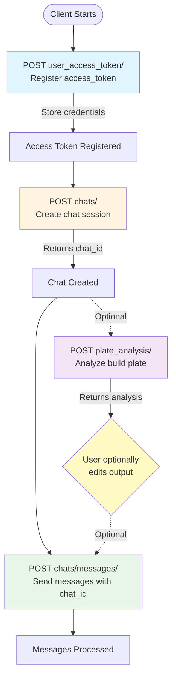

This document describes the high-level flow for using Elegoo functional APIs, starting with user access token registration.

## Overview

The Elegoo API flow consists of:
1. **Registration**: Register user credentials via `user_access_token/` endpoint
2. **Chat Creation**: Create a chat session via `chats/` endpoint to obtain a `chat_id`
3. **Chat Messages**: Send messages to the chat using `chats/messages/` endpoint with the `chat_id`
4. **Plate Analysis** (Optional): Analyze build plate using `plate_analysis/` endpoint

## API Flow Diagram

## Step-by-Step Flow

### Step 1: Register User Access Token

**Endpoint**: `POST /ent/partners/api/elegoo/user_access_token/`

Register or update user credentials. This endpoint stores the `access_token` and `elegoo_user_id` pair for authentication in subsequent API calls.

**Required**: `elegoo_user_id`, `access_token`, `expire_in`

### Step 2: Create Chat Session

**Endpoint**: `POST /ent/partners/api/elegoo/chats/`

Create a new chat session. This endpoint returns a `chat_id` that is required for sending messages.

**Required**: `elegoo_user_id`, `access_token` (for authentication)

**Returns**: `chat_id` (used in next step)

### Step 3: Send Chat Messages

**Endpoint**: `POST /ent/partners/api/elegoo/chats/messages/`

Send messages to the chat session. This endpoint requires the `chat_id` obtained from Step 2.

**Required**: `elegoo_user_id`, `access_token` (for authentication), `chat_id` (from Step 2)

**Note**: `chats/` must be called before `chats/messages/` to obtain the `chat_id`.

### Step 4: Plate Analysis (Optional)

**Endpoint**: `POST /ent/partners/api/elegoo/plate_analysis/`

Analyze build plate images. This endpoint is optional and can be called independently of the chat flow.

**Required**: `elegoo_user_id`, `access_token` (for authentication)

**Optional Flow**: The output from `plate_analysis/` can be optionally edited by the user and then sent to `chats/messages/` as an input query.

## Authentication

All functional APIs (`chats/`, `chats/messages/`, `plate_analysis/`) require authentication using:
- `elegoo_user_id`: The Elegoo user identifier
- `access_token`: The access token registered via `user_access_token/` endpoint

These credentials can be provided in:
- POST request body (JSON)
- Query parameters (for GET requests or POST requests)

## Key Points

- **Sequential Dependency**: `chats/` must be called before `chats/messages/` to obtain the `chat_id`
- **Optional Endpoint**: `plate_analysis/` can be called independently and is not required for the chat flow
- **Plate Analysis Integration**: The output from `plate_analysis/` can be optionally edited by the user and sent to `chats/messages/` as an input query
- **Token Management**: Access tokens must be registered via `user_access_token/` before they can be used for authentication
- **Token Expiration**: Access tokens expire based on the `expire_in` value provided during registration

